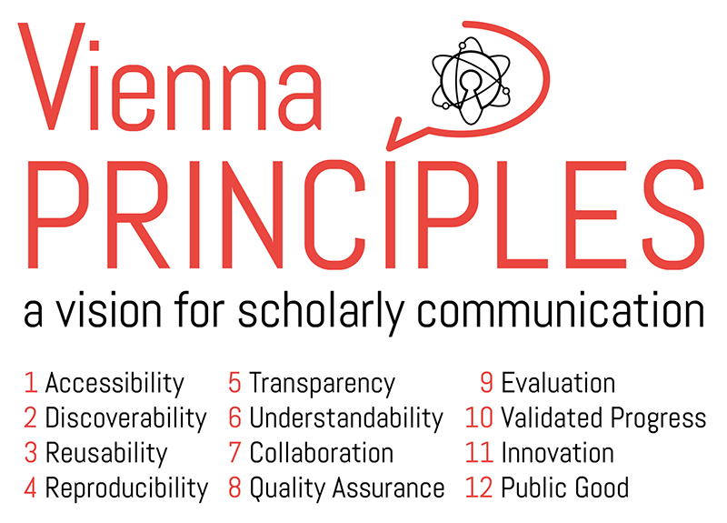

# The Vienna Principles: A Vision for Scholarly Communication in the 21st Century

This is an auxiliary repository for the [Vienna Principles](http://viennaprinciples.org), published on [Zenodo](https://zenodo.org/record/55597).

## License
The contents of this repository are distributed under the terms of the [Creative Commons Attribution 4.0 International License](https://creativecommons.org/licenses/by/4.0/), which permits unrestricted use, distribution, and reproduction in any medium, provided the original authors and source are credited.