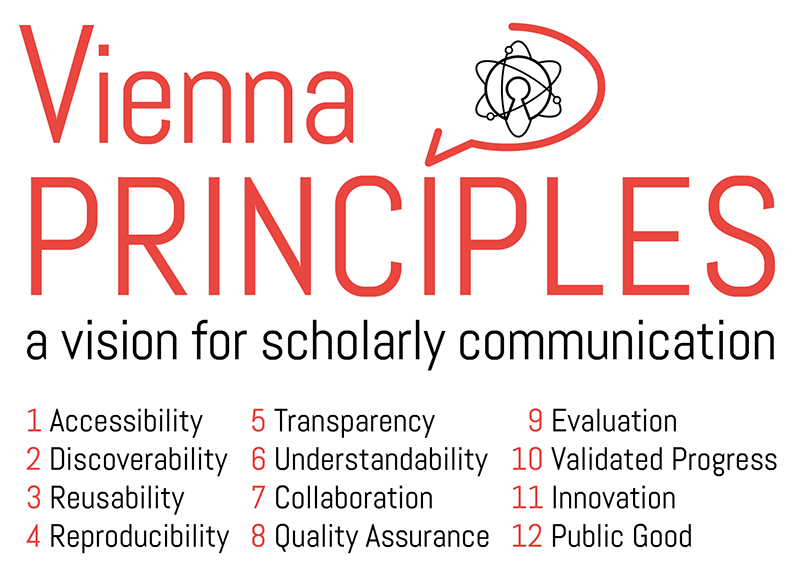

# The Vienna Principles: A Vision for Scholarly Communication in the 21st Century

**Working Group “Open Access and Scholarly Communication” of the [Open Access Network Austria (OANA)](http://oana.at)**

**Core Authors:** *[Peter Kraker](http://orcid.org/0000-0002-5238-4195) (Know-Center, Working Group Lead), [Daniel Dörler](https://forschung.boku.ac.at/fis/suchen.person_uebersicht?sprache_in=de&menue_id_in=101&id_in=136201) (University of Natural Resources and Life Sciences, Vienna), [Andreas Ferus](http://orcid.org/0000-0003-2509-0009) (Academy of Fine Arts Vienna), [Robert Gutounig](http://orcid.org/0000-0001-8346-7949) (University of Applied Sciences (UAS) JOANNEUM), [Florian Heigl](https://forschung.boku.ac.at/fis/suchen.person_uebersicht?sprache_in=en&ansicht_in=&menue_id_in=101&id_in=113247) (University of Natural Resources and Life Sciences, Vienna), [Christian Kaier](http://orcid.org/0000-0002-8750-6666) (University of Graz), [Katharina Rieck](http://orcid.org/0000-0002-9316-165X) (Austrian Science Fund (FWF)), [Elena Šimukovič](http://orcid.org/0000-0003-1363-243X), [Michela Vignoli](http://orcid.org/0000-0002-9495-5697) (AIT Austrian Institute of Technology)*

**Contributors:** *Edeltraud Aspöck (Austrian Academy of Sciences), Sebastian Dennerlein (Graz University of Technology), Asura Enkhbayar (Know-Center), Gerda McNeill (University of Vienna), Nora Schmidt (Lund University), Gregor Steinrisser-Allex (Medical University of Graz), Eveline Wandl-Vogt (Austrian Academy of Sciences)*

**Contact:** [Peter Kraker](http://orcid.org/0000-0002-5238-4195) (Know-Center), [pkraker@know-center.at](mailto:pkraker@know-center.at) 

**Publication Date:** 15 June 2016 (Version 1)

**Funding:** All authors were either funded by their respective institution or self-funded.

**Copyright:** This is an open access article distributed under the terms of the Creative Commons Attribution 4.0 International License, which permits unrestricted use, distribution, and reproduction in any medium, provided the original authors and source are credited.

## Introduction
Between April 2015 and June 2016, members of the Open Access Network Austria (OANA) working group “Open Access and Scholarly Communication” met in Vienna to discuss a fundamental reform of the scholarly communication system. 

> By scholarly communication we mean the processes of producing, reviewing, organising, disseminating and preserving scholarly knowledge (This definition is based on the definition found in [Wikipedia](http://en.wikipedia.org/wiki/Scholarly_communication) [05 June 2016]). Scholarly communication does not only concern researchers, but also society at large, especially students, educators, policy makers, public administrators, funders, librarians, journalists, practitioners, publishers, public and private organisations, and interested citizens. 

Like many of our peers, we hold the opinion that there are considerable deficits in how scholarly knowledge is produced and disseminated. And like many of our peers, we think that the time has come to address these deficits. In the working group, we took a critical stance on the current debate, which mainly centers around Open Science (including elements like Open Access). We believe that Open Science has the potential to change the workings of the scholarly communication system for the better - but we see openness as a means to an end. When we call for openness in scholarly communication, we usually try to achieve an underlying principle, such as accessibility or reusability. Within the Open Science community, however, there is no commonly agreed set of principles that describe the system of scholarly communication that we want to create. There is a lot of discussion on what constitutes openness, how to achieve openness and what steps to take next. In these discussions many of the arguments carry implicit assumptions about the structures of a future scholarly communication system. We think that making assumptions explicit is sorely needed to better guide the debate around Open Science. We also think that a vision that answers the question “what for?” would help to better convey the need for openness in scholarly communication to academia and society. After all, Open Science is still a fuzzy concept for many; grounding it in a set of widely shared principles would make it much more understandable.

This is why we set out to define a coherent vision for scholarly communication, which led to a thorough discussion process that lasted over a year and involved more than twenty people from a wide variety of institutions and disciplines. This document is the main outcome of our considerations: first, we describe problems of the status quo of scholarly communication, i.e. the world we live in. Then we propose twelve principles of scholarly communication that describe the world we want to live in.

*We have created this document hoping to inspire a widespread discussion towards a shared vision for scholarly communication. We welcome feedback, criticism, and hints on what we may have missed. We do not see this document as the end of the matter; it is a first version that will hopefully have many revisions as we jointly create the scholarly communication system of the future.*

## Deficits of the Current Scholarly Communication System
### Restricted access and collaboration
* Research results are often not publicly accessible even if they have been funded by the public.
* Highly relevant research materials from publicly funded archives, museums, libraries and statistical inventories are either not available in digital form or inaccessible.
* Restricted access to and delayed dissemination of scholarly results limit knowledge transfer to researchers and other members of society. 
* Production of scholarly knowledge often happens in a closed system excluding expertise and experiences of scholars outside academia and other members of society. This is detrimental to research and restrains innovation.
* Due to closed modes of communication, opportunities for collaboration among various actors remain unexploited.
* Research output is often communicated in a highly abstract domain-specific language, preventing knowledge dissemination to other research fields and to other members of society.

### Inefficient processes
* The scholarly communication system is highly inefficient and exceedingly expensive, albeit the emergence of electronic publishing, which greatly reduced printing and postal delivery costs, among others.
* The possibilities of digital technologies are currently not fully exploited in scholarly communication. Despite the ever-growing tool and infrastructure landscape, traditional scholarly communication methods tend to prevail in many research disciplines.
* Research output has grown exponentially over the last few centuries. This has led to an enormous increase in knowledge, but also to information overload. A lot of time is needlessly wasted on duplicated work.
* The peer review system is overloaded and many research results are reviewed multiple times due to high rejection rates.

### Lack of reproducibility and transparency
* The majority of research results cannot be reproduced due to lack of underlying data, process instructions and context information.
* Adequate contextual information is often missing, making it difficult to determine whether a piece of research is credible and can be built upon.
* Evaluation by peer review has a mighty filtering function but is often untransparent and potentially biased.
* There has been a rise in retractions as a result of flawed practices, as well as (un)conscious wrongdoing.

### Technical and legal barriers
* Research products (data, materials, source code, etc.) often cannot be reused due to technical and legal restrictions (e.g. copyright).
* Overly restrictive copyright transfer agreements impede knowledge circulation, and contribute to an oligopoly of publishers and information service providers.

### Incentives in need of improvement
* The quantity of research output is often valued over its quality. Scholars are incentivised to publish research results in small pieces, which boosts the overall costs of academic publishing while impeding new, original research. 
* Scholarly communication is constrained by current reward structures largely favouring publication of research results in renowned academic publishing venues.
* Peer review is not adequately acknowledged as a scholarly activity although it enhances and ensures the quality of research output.

## The Twelve Principles of Scholarly Communication 

####*Scholarly communication should …*

####1. Accessibility: *… be immediately and openly accessible by anyone.*
The production of knowledge serves mankind and increases prosperity. Free and open dissemination of knowledge within the scientific community and beyond facilitates exchange, collaboration and the application of research results. There should be no technical, financial or legal obstacles delaying or preventing the accessibility of research findings. All research results should be accessible to people that are diverse in physical, economic and other conditions. Access should be ensured in the long-term.

#### 2. Discoverability: *… facilitate search, exploration and discovery.*
There have never been as many scholars as today, and never have they been as prolific as today due to new modes of communication and technology that is cheaper and more widely available. Researchers spend considerable time not only with communicating their own research, but also with staying up-to-date with the work of their colleagues. A system of scholarly communication should therefore organise scientific knowledge in such a way that it enables researchers and their stakeholders to efficiently and effectively identify research that is relevant to them. In addition, researchers should be able to find feedback on their own work and activities connected to it as easily as possible.

#### 3. Reusability: *… enable everyone to effectively build on top of each other’s work.*
Following Newton’s phrase “Standing on the shoulders of giants”, modern scholarship is based on cooperation. Ideas are not created in a vacuum. Reuse of research processes, methods and results as well as abstraction and extension should therefore represent basic values of scholarly communication. The possibility to reuse data, materials and results enables researchers and communities to learn from each other and to speed up the production of new knowledge. Consequently, while appropriate attribution of authorship must be ensured, a maximum of reuse and processing should be permissible.

#### 4. Reproducibility: *… provide reproducible research results.*
Reproducibility of research findings is one of the distinctive features of research and a gold standard in many disciplines. As a minimum requirement, the research process should be traceable, e.g. by providing access to raw data and documenting the research process as well as the (intermediate) results (discussions, research diaries, pre-publications etc.). This facilitates an understanding of the methodology and simplifies assessment. Opening up the methodology and production of results also helps to identify cases of unconscious wrongdoing, deception, and fraud. It should be possible to identify different stages of a research process and to understand its evolution. 

#### 5. Transparency: *… provide open and transparent means for judging the credibility of a research result.*
Virtually all new knowledge builds upon past findings, but in practice one cannot reproduce every research result to verify its credibility. A system of scholarly communication should therefore make it possible to judge the credibility of research results based on context information. This information may stem from the authors as well as from peer review or other forms of feedback. Context information should answer the five classic Ws: who, what, when, where and why, as well as the questions “Who paid for it?” and “How was it received?”. Details on funding and on the relationship of researchers to study subjects highlight potential conflicts of interest and how ethical questions were addressed. Information that should be available at any point is whether a piece of research has been corrected or retracted after publication.

#### 6. Understandability: *… provide research in a clear, concise and understandable way adjusted to different stakeholders.*
A fruitful dialogue among researchers and between researchers and their stakeholders is mutually beneficial for both research and society. Keeping communication as clear and concise as possible facilitates knowledge transfer and exchange within research and beyond. What is considered clear and concise, however, is very dependent on the recipient and the situation. Communication amongst researchers usually involves a high degree of abstraction and special language, whereas communication with interested citizens requires more broadly understandable language. Scholarly communication should therefore be adapted for different stakeholder groups inside and outside of academia, by taking into account specific requirements in order to make it more meaningful and allowing for further involvement and participation.

#### 7. Collaboration: *… foster collaboration and participation between researchers and their stakeholders.*
Research is often of relevance to a great variety of stakeholders such as patients and doctors, students and teachers. Researchers and their stakeholders can benefit from working together, ranging from discussion over participation to real collaboration with lay communities in citizen science projects. Collaboration leads to a better understanding of research among stakeholders, and stakeholders can point out research questions that are important to them. Researchers can get feedback on their work, and in cases even receive support in conducting their research. Scholarly communication should therefore facilitate and encourage these forms of collaboration.

#### 8. Quality Assurance: *… provide transparent and competent review.*
Reviewing safeguards research discoveries, ensuring that results can be trusted and built upon. A system of scholarly communication should therefore incentivize, reward, and recognize reviewing, no less than doing research in order to create a balance between the production of knowledge and its consolidation. The primary function of reviewing should be to ensure that research is technically sound and that the results can be reproduced/that the research process is traceable. Transparent communication and open peer review can help to raise the quality of reviews and to avoid biased and hasty judgements.

#### 9. Evaluation: *… support fair evaluation.*
Evaluation influences the perceived impact of research results, researchers, journals or institutions, and therefore the way scientific knowledge is produced. It is therefore essential that these evaluation processes are conducted fairly and adequately. Assessment should offer an overall, multidimensional analysis, especially in an interdisciplinary context. Researchers should be given the opportunity to comment on evaluation results and they should be able to verify data collection and analysis processes. To build future research on solid ground, reward structures should be adopted and quality in research must be favoured over quantity. Adequate incentives should be provided to reward endeavours to publish better, rather than more.

#### 10. Validated Progress: *… promote both the production of new knowledge and the validation of existing knowledge.*
In order for scholarship to progress, it needs original research that contributes novel results to the body of knowledge. A system of scholarly communication should identify research gaps and highlight fields that need engagement and contribution. Uncertainty and risk-taking should be accepted in order to encourage testing of unusual methods and theories. But research also needs the validation of existing results in order to build future research on solid ground. Therefore, a system of scholarly communication should also promote the reproduction and continual validation of existing knowledge. The two functions should be appropriately balanced to achieve validated progress. 

#### 11. Innovation: *… embrace the possibilities of new technology.*
Over the past 400 years, scholarly communication has been constantly evolving. This evolution has opened up new opportunities for researchers to work and collaborate. Therefore, scholarly communication should embrace the possibilities of new technology. The Web, in particular, has revolutionised the way we create, disseminate, explore and consume information, and its potentials are not fully exploited yet for scholarly communications. These potentials include real-time exchange and dissemination, ubiquitous and simultaneous availability of resources, zero marginal cost for dissemination, new workflows, improved reusability of data and results, the ability to process huge volumes of data and new forms of presenting and visualising results. 

#### 12. Public Good: *… expand the knowledge commons.*
Scientific knowledge is critical for the development of society. As scientific knowledge is intangible in nature, its use by one person does not preclude its use by another person. On the contrary, knowledge tends to grow when it is shared. Therefore, no barriers should be established to restrict the use and reuse of research results. Scientific knowledge should be a public good and as such part of the knowledge commons, in order to enable everyone in society to benefit from this knowledge.

## Acknowledgements
The authors would like to thank Katja Mayer, Falk Reckling, Erich Prem, Margit Hofer, Stefan Kasberger, and the participants of the 3rd Plenary of the Open Access Network Austria and the 15th Annual STS Conference, Graz for helpful comments on the draft. We would like to thank Maxi Schramm for providing the image “Vienna Principles”, Michael McNeill for proofreading and Brigitte Wandl for the layout.

The image “Vienna Principles” contains artwork by [Kim Holmberg](https://pixabay.com/de/offene-wissenschaft-wissenschaft-735787/), licensed under CC0, and makes use of the font “Abel” by [Matthew Desmond](http://www.madtype.com/webfonts/), licensed under SIL Open Font License, 1.1. 

The Know-Center is funded within the Austrian COMET program - Competence Centers for Excellent Technologies - under the auspices of the Austrian Federal Ministry of Transport, Innovation and Technology, the Austrian Federal Ministry of Economy, Family and Youth, and the State of Styria. COMET is managed by the Austrian Research Promotion Agency FFG.

